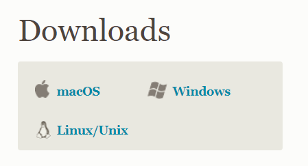
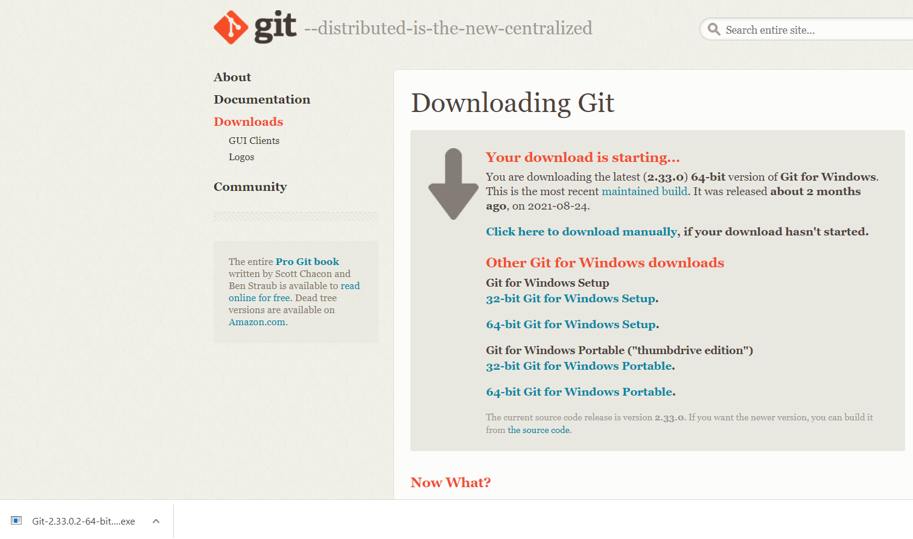
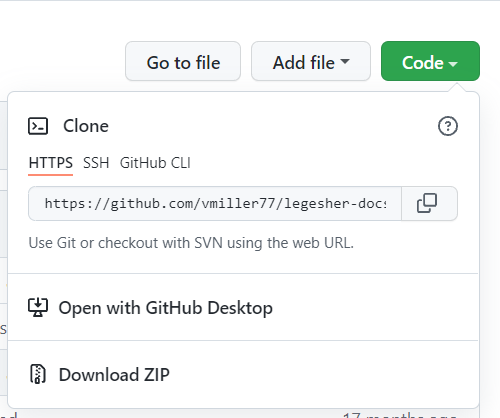
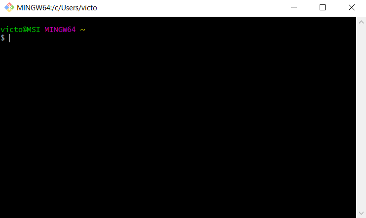
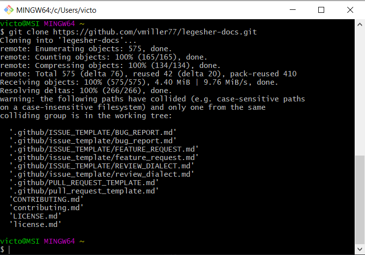

# What is Git command line?

Git command line is an application you can install on your computer that allows you to manage your git projects.
It combines the Bash command line experience with git commands. Through the git command line application, you will be able to navigate your projects, add your code changes, and push your changes to your repository hosted on GitHub.

# Adding Git to your machine

Go to [git scm downloads](https://git-scm.com/downloads) to download and install Git to your machine.

You will choose one of the options based on your operating system.



Once you download the proper files, you should see an exe file in your bottom left corner of your browser. You can click on it to start the process of installing Git to your machine.



Follow through with the installation process. The defaults are typically good and enough for you to get started with Legesher.

# Forking a Legesher Repository

You are now ready to fork a Legesher Repository. A fork is a copy of a repository. Forking a repository allows you to freely experiment with changes without affecting the original project.

You will need to choose which Legesher Repository you want to fork. Take a look at the repositories and descriptions below to pick one that you are interested in contributing to.

| Project                                                                                  | Purpose                                                                                                   |
| ---------------------------------------------------------------------------------------- | --------------------------------------------------------------------------------------------------------- |
| [`tree-sitter-legesher-python`](https://github.com/legesher/tree-sitter-legesher-python) | Tree-sitter python grammar used by text editors allowing Legesher's languages to be implemented           |
| [`language-legesher-python`](https://github.com/legesher/language-legesher-python)       | Atom's programming language binding to allow syntax highlighting, code folding etc. to a specific grammar |
| [`legesher-translations`](https://github.com/legesher/legesher-translations)             | Host and API of all the language translations for written languages for code keywords / concepts          |
| [`legesher-dot-io`](https://github.com/legesher/legesher-dot-io)                         | Legesher's public [website](https://legesher.io)                                                          |
| [`legesher-docs`](https://github.com/legesher/legesher-docs)                             | Legesher's documentation hub. Will be transitioning to a documentation host soon.                         |
| [`legesher`](https://github.com/legesher/legesher)                                       | Git integration to collaborate with code and others in other languages                                    |
| [`legesher-pride`](https://github.com/legesher/legesher-pride)                           | A non-programmer's dream to contributing to open source by sharing what they know and learning what's new |

Once you have decided which repository you want to fork, go to it. In this tutorial, we will continue with the legesher-docs repository.

## Forking the legesher-docs repository

You can follow these instructions for any legesher repository you want.

Go to the repository site and click on the fork button on the top-right corner.


Github may ask where you want to fork this repository to. Choose where you want to fork it. After this step, you will redirected to a new page of your newly forked repository. You will notice that the path for your repository is different than legesher/legesher-docs. It will likely be something along the lines of username/legesher-docs. Congratulations :tada: you have officially forked a repository!


# Cloning your Forked Repository to your Local Computer

After forking the repository, you will need to clone it to your local machine. Cloning a repository pulls down a full copy of all the repository data that GitHub has at that point in time, including all versions of every file and folder for the project. This is important to pull down to your machine, so you can interact with the code or files on your computer. Otherwise, you will have to add files directly through Github in a browser.

Press the green Code button. A popup with options to clone your repository will show. Copy the link provided.



Open your Git Bash application you downloaded earlier. It should look something like this:



You will need to navigate to a folder in your desktop where you feel comfortable holding the legesher repository you have forked and cloned.
A command that is useful is the cd command. Please take a look at this link [cd command guide](https://www.educative.io/edpresso/what-is-git-bash-change-directory) to help you better understand the cd or change directory command.

Once you have reached the place you would like to clone your repository to, you can type the following command into your GitBash:
```
git clone <url you copied earlier>
```
Your GitBash should look something like this:



Congratulations :tada: you have officially cloned your repository to your machine!

You can now start tinkering!
