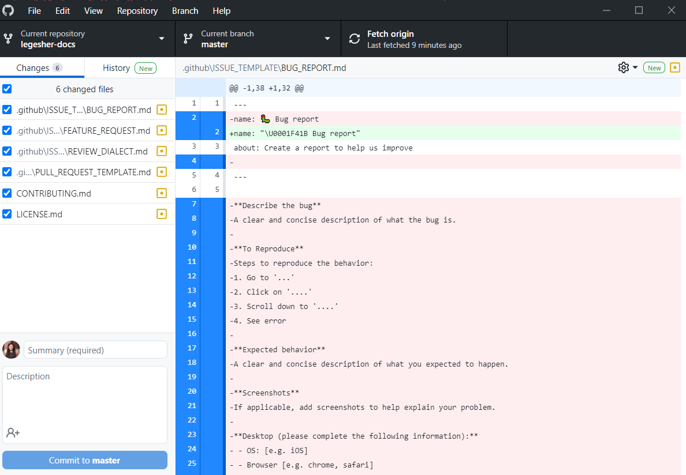
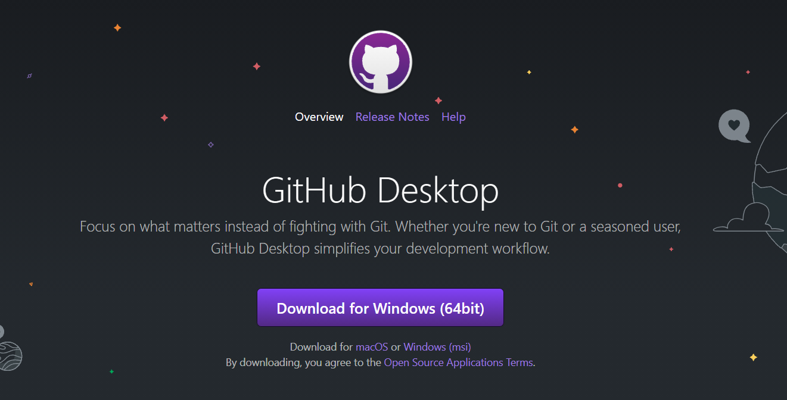
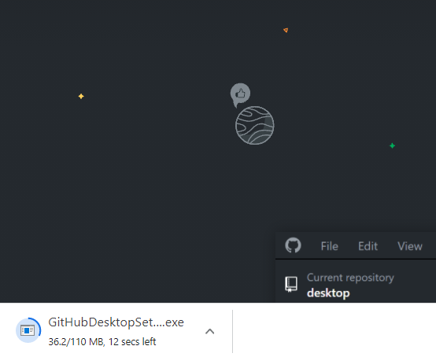
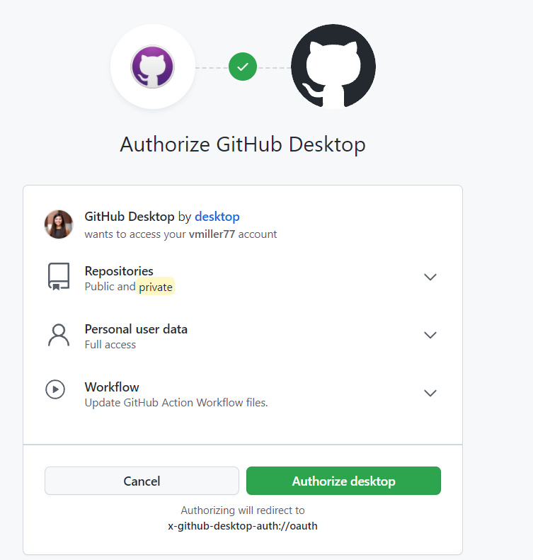
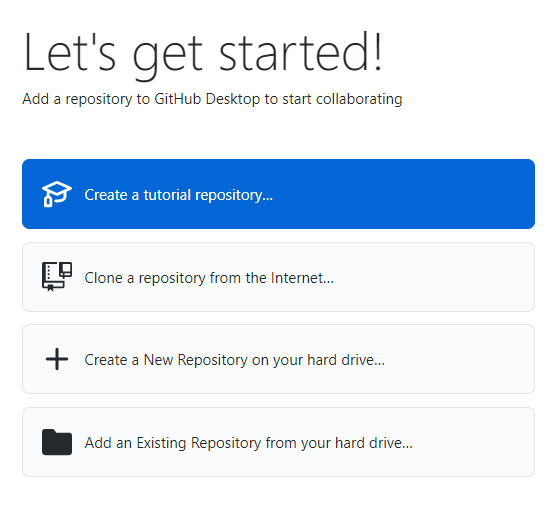
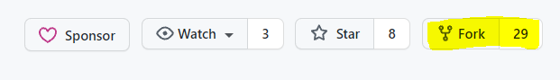
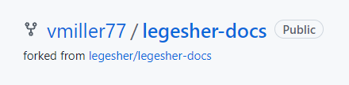
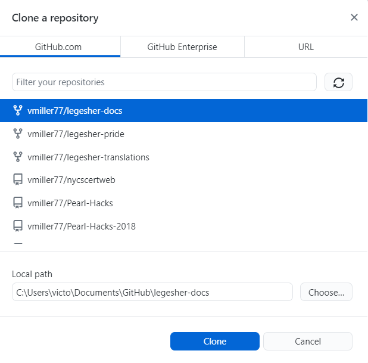
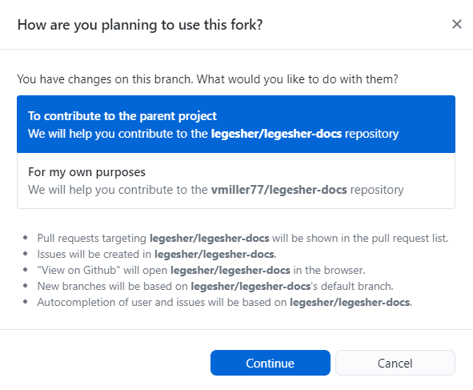

# What is Github Desktop?

GitHub Desktop is an application you can install on your computer that allows you to manage your git projects.
This is an alternative to git cli which uses the command line interface to manage your projects. GitHub Desktop provides a wonderful user interface that allows user to manage projects in a more visual manner. Below is an example of what you might see if you use GitHub Desktop.

# Getting GitHub Desktop

Go to [git scm downloads](https://desktop.github.com/) to download and install GitHub Desktop to your machine. You will need to press the purple button. If you have a different operating system than the one originally suggested, choose the option links directly below the purple button.

Once you have pressed the purple download button, you should get a download file like the one in the image below. Click on this file and run it.

After GitHub Desktop downloads, you will be prompted to sign in or sign up. Assuming you already have a GitHub account, you can choose the blue button, Sign in to GitHub.com

")

You will then be prompted to login and authorize your account. You will also configure your account. You can choose the defaults for configuring your account.

After you choose the green Authorize desktop button, you will come to the let's get started page.

# Forking a Legesher Repository

You are now ready to fork a Legesher Repository. A fork is a copy of a repository. Forking a repository allows you to freely experiment with changes without affecting the original project.

You will need to choose which Legesher Repository you want to fork. Take a look at the repositories and descriptions below to pick one that you are interested in contributing to.

| Project                                                                                  | Purpose                                                                                                   |
| ---------------------------------------------------------------------------------------- | --------------------------------------------------------------------------------------------------------- |
| [`tree-sitter-legesher-python`](https://github.com/legesher/tree-sitter-legesher-python) | Tree-sitter python grammar used by text editors allowing Legesher's languages to be implemented           |
| [`language-legesher-python`](https://github.com/legesher/language-legesher-python)       | Atom's programming language binding to allow syntax highlighting, code folding etc. to a specific grammar |
| [`legesher-translations`](https://github.com/legesher/legesher-translations)             | Host and API of all the language translations for written languages for code keywords / concepts          |
| [`legesher-dot-io`](https://github.com/legesher/legesher-dot-io)                         | Legesher's public [website](https://legesher.io)                                                          |
| [`legesher-docs`](https://github.com/legesher/legesher-docs)                             | Legesher's documentation hub. Will be transitioning to a documentation host soon.                         |
| [`legesher`](https://github.com/legesher/legesher)                                       | Git integration to collaborate with code and others in other languages                                    |
| [`legesher-pride`](https://github.com/legesher/legesher-pride)                           | A non-programmer's dream to contributing to open source by sharing what they know and learning what's new |

Once you have decided which repository you want to fork, go to it. In this tutorial, we will continue with the legesher-docs repository.

## Forking the legesher-docs repository

You can follow these instructions for any legesher repository you want.

Go to the repository site and click on the fork button on the top-right corner.

GitHub may ask where you want to fork this repository to. Choose where you want to fork it. After this step, you will redirected to a new page of your newly forked repository. You will notice that the path for your repository is different than legesher/legesher-docs. It will likely be something along the lines of username/legesher-docs. Congratulations :tada: you have officially forked a repository!

# Cloning your Forked Repository to your Local Computer

After forking the repository, you will need to clone it to your local machine. Cloning a repository pulls down a full copy of all the repository data that GitHub has at that point in time, including all versions of every file and folder for the project. This is important to pull down to your machine, so you can interact with the code or files on your computer. Otherwise, you will have to add files directly through GitHub in a browser.

On your Let's Get Started Page from your GitHub Desktop App, you should see the second option is to clone a repository from the internet.

Once you choose this option, you can choose from a list of your online forked repositories. You should see the repository you forked earlier. There is an option on the bottom to choose where your cloned repository goes in your machine. You can change this based on your preferences, or leave the default path. Choose this one and then press the blue Clone button at the bottom.

After the repository is finished cloning, you will get a message like the one below. You can choose the option "To contribute to the parent project" and then press continue.

Congratulations :tada: you have successfully cloned your repository to your machine!

You can now start tinkering!

There are tons of documentations out there to help you manage your project in GitHub Desktop. This one may be particularly useful
[Committing and Reviewing your Changes to Your Project]("https://docs.github.com/en/desktop/contributing-and-collaborating-using-github-desktop/making-changes-in-a-branch/committing-and-reviewing-changes-to-your-project")
